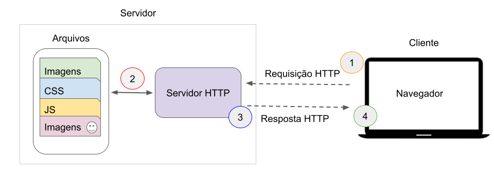

# Informações do Projeto
`TÍTULO DO PROJETO`  

......  PELAS AMERICAS ......

`CURSO` 

......  CIÊNCIA DA COMPUTAÇÃO ......

## Participantes

......  MEMBROS ......

> Os membros do grupo são: 
> - Gabriel Chagas Lage
> - Lucas Gentil
> - João Pedro Cruz
> - Caio Souza
> - Gabriel Alves Reis
> - Pedro Henrique 
> - Benjamin Doné

# Estrutura do Documento

- [Informações do Projeto](#informações-do-projeto)
  - [Participantes](#participantes)
- [Estrutura do Documento](#estrutura-do-documento)
- [Introdução](#introdução)
  - [Problema](#problema)
  - [Objetivos](#objetivos)
  - [Justificativa](#justificativa)
  - [Público-Alvo](#público-alvo)
- [Especificações do Projeto](#especificações-do-projeto)
  - [Personas, Empatia e Proposta de Valor](#personas-empatia-e-proposta-de-valor)
  - [Histórias de Usuários](#histórias-de-usuários)
  - [Requisitos](#requisitos)
    - [Requisitos Funcionais](#requisitos-funcionais)
    - [Requisitos não Funcionais](#requisitos-não-funcionais)
  - [Restrições](#restrições)
- [Projeto de Interface](#projeto-de-interface)
  - [User Flow](#user-flow)
  - [Wireframes](#wireframes)
- [Metodologia](#metodologia)
  - [Divisão de Papéis](#divisão-de-papéis)
  - [Ferramentas](#ferramentas)
  - [Controle de Versão](#controle-de-versão)
- [**############## SPRINT 1 ACABA AQUI #############**](#-sprint-1-acaba-aqui-)
- [Projeto da Solução](#projeto-da-solução)
  - [Tecnologias Utilizadas](#tecnologias-utilizadas)
  - [Arquitetura da solução](#arquitetura-da-solução)
- [Avaliação da Aplicação](#avaliação-da-aplicação)
  - [Plano de Testes](#plano-de-testes)
  - [Ferramentas de Testes (Opcional)](#ferramentas-de-testes-opcional)
  - [Registros de Testes](#registros-de-testes)
- [Referências](#referências)

# Introdução

## Problema

> Viajantes que querem planejar melhor suas viagens ou que tem  
> dificuldades. Até mesmo para alguns bons curiosos....

## Objetivos

> Ajudar viajantes brasileiros a viajarem para outros países dentro da America
> com mais facilidade

## Justificativa

> Tentar facilitar a vida dos vianjantes para fora do país

## Público-Alvo

> Viajantes pela America.

> Jovem, 25 anos, recém formado que deseja fazer um semestre vianjando pelo
> continente americano.

> Casal de 30 e poucos anos, classe média, afim de realizar uma viagem no fim do ano.

> Empresário de 40 anos, que viaja a trabalho internacionalmente todas as semanas.

 
# Especificações do Projeto

> Projeto será realizado com HTML, CSS, JAVASCRIPT com interrações com algumas API´s como a do mapbox.

## Personas, Empatia e Proposta de Valor

> **Exemplo de Persona**
> 
> 

> **Exemplo de Proposta de Valor**
>
> 

## Histórias de Usuários

Com base na análise das personas forma identificadas as seguintes histórias de usuários:

|EU COMO... `PERSONA`| QUERO/PRECISO ... `FUNCIONALIDADE` |PARA ... `MOTIVO/VALOR`                 |
|--------------------|------------------------------------|----------------------------------------|
|Usuário do sistema  | Acessar as informações             | Me ajudar a viajar                     |
|Administrador       | Trazer as informações              | Ajudar amelhor organização da viagem   |

## Requisitos

### Requisitos Funcionais

|ID    | Descrição do Requisito  | Prioridade |
|------|------------------------------------------ |-------|
|RF-001| Fazer que o mapa americano seja funcione  | ALTA  | 
|RF-002| Fazer a descrição de cada país            | MÉDIA |

### Requisitos não Funcionais

|ID     | Descrição do Requisito  |Prioridade |
|-------|-------------------------|----|
|RNF-001| O sistema deve ser responsivo para rodar em um dispositivos móvel | BAIXA | 
|RNF-002| Deve processar requisições do usuário em no máximo 3s |  BAIXA | 

## Restrições

O projeto está restrito pelos itens apresentados na tabela a seguir.

|ID| Restrição                                             |
|--|-------------------------------------------------------|
|01| O projeto deverá ser entregue até o final do semestre |

# Projeto de Interface

> Apresente as principais interfaces da solução. Discuta como 
> foram elaboradas de forma a atender os requisitos funcionais, não
> funcionais e histórias de usuário abordados nas [Especificações do
> Projeto](#especificações-do-projeto).

## Wireframes

> 

# Metodologia

> - [LINK :] https://trello.com/b/i67xN8LX/tial-turismo-1

## Divisão de Papéis

> - Gabriel Chagas Lage - CTO / CIO
> - Lucas Gentil - COO 
> - João Pedro Cruz - CTO
> - Caio Souza - CTO 
> - Gabriel Alves Reis - CCO
> - Pedro Henrique - ESTAGIÁRIO
> - Benjamin Doné - CHRO

## Ferramentas

| Ambiente  | Plataforma              |Link de Acesso |
|-----------|-------------------------|---------------|
|Processo de Design Thinkgin  | Miro |  https://miro.com/app/board/uXjVMY8ZlV0=/ | 
|Repositório de código | GitHub | https://github.com/ICEI-PUC-Minas-PMGCC-TI/ti-1-pmg-cc-m-20231-tiaw-turismo-1 | 
|Hospedagem do site | Heroku |  https://XXXXXXX.herokuapp.com | 
|Protótipo Interativo | MavelApp ou Figma | https://www.figma.com/file/xyjdnpPhc8MqNxNobEQseD/Untitled?node-id=0%3A1&t=ChODKyBNBJk3RFHd-1 | 

## Controle de Versão
 
> O projeto segue a seguinte convenção para o nome de branchs:
> 
> - `main`: versão estável já testada do software
> - `staging`: versão de desenvolvimento do software

# **############## SPRINT 1 ACABA AQUI #############**

# Projeto da Solução

......  COLOQUE AQUI O SEU TEXTO ......

## Tecnologias Utilizadas

- Para a construção do projeto foram utilizadas o HTML (HyperText Markup Language)
para estruturar o conteúdo da página web. Em conjunto com o html, foi utilizado
o CSS (Cascading Style Sheets) para controlar a aparência e o layout dos 
elementos da página web. Por fim, o JavaScript que permite a manipulação do conteúdo HTML,
interação com o usuário e geração de movimento na aplicação. Além das linguagens de
programação também foi utilizado apis (Application Programming Interface). 

- APIs como: leafletjs, ExchangeRate-API.

## Arquitetura da solução

> **Exemplo do diagrama de Arquitetura**:
> 
> 

# Avaliação da Aplicação

Teste de seleção de cidade:

Descrição: Verificar se o usuário pode selecionar uma cidade na América a partir do mapa.
Etapas:
Abrir a aplicação.
Clicar em uma cidade no mapa.
Verificar se a cidade selecionada é exibida corretamente na interface.

Teste de exibição de informações sobre pontos turísticos:

Descrição: Verificar se as informações sobre pontos turísticos estão sendo exibidas corretamente para a cidade selecionada.
Etapas:
Selecionar uma cidade na América.
Verificar se a lista de pontos turísticos relacionados à cidade é exibida.
Clicar em um ponto turístico.
Verificar se as informações detalhadas sobre o ponto turístico são exibidas corretamente.

Teste de busca de informações específicas:

Descrição: Verificar se a função de busca retorna resultados relevantes para os critérios especificados.
Etapas:
Digitar um termo de busca na caixa de pesquisa.
Verificar se os resultados exibidos são relevantes para o termo de busca.
Clicar em um dos resultados da pesquisa.
Verificar se as informações exibidas correspondem ao termo de busca e são consistentes com a cidade selecionada.

Teste de navegação no mapa:

Descrição: Verificar se o usuário pode navegar pelo mapa e selecionar diferentes cidades na América.
Etapas:
Arrastar o mapa para uma nova área.
Verificar se as cidades da nova área são exibidas corretamente.
Selecionar uma cidade diferente.
Verificar se as informações sobre a nova cidade são exibidas corretamente.

## Plano de Testes

Cenários de testes foram selecionados para teste:

Fazer o deployment do sistema e criar uma url. Distribuir esta url para varios usuários com características diferentes (ex: faixa etária, sexo, renda)
pedir para os usuários sondarem o sistema e dizer o que mais incomoda neles. Exemplo real de teste:

Laura é uma profissional bem-sucedida que trabalha como gerente de marketing em uma empresa de médio porte. Ela é apaixonada por viagens e adora explorar novos destinos. Laura tem um estilo de vida agitado devido às suas responsabilidades profissionais, mas sempre encontra tempo para planejar suas férias e escapar da rotina. Ela está constantemente buscando novas experiências culturais, pontos turísticos interessantes e restaurantes locais para enriquecer suas viagens.

Laura encontra problemas de navegação e falta de estilo na aplicação de turismo

Descrição:
Laura está animada para planejar sua próxima viagem e decide acessar o site de turismo que foi recomendado por um amigo. Ela espera encontrar informações detalhadas sobre destinos, pontos turísticos, restaurantes e também utilizar o conversor de moedas para planejar seus gastos. No entanto, ao entrar na aplicação, ela se depara com alguns problemas.

Passos:

Laura acessa o site de turismo.
Ela é direcionada para a página inicial, mas não consegue encontrar um botão ou link para voltar à página inicial caso deseje retornar durante sua navegação.
Laura decide explorar os recursos da aplicação e clica na opção de conversor de moedas.
Ela percebe que a página do conversor de moedas não possui um estilo adequado, apresentando uma aparência desalinhada e falta de elementos visuais atrativos.
Laura tenta utilizar o conversor de moedas, inserindo um valor monetário e selecionando as moedas desejadas para conversão.
No entanto, ela encontra dificuldades em compreender o resultado da conversão, pois a falta de estilos e formatação adequados dificulta a leitura e interpretação dos valores convertidos.
Resultado Esperado:

Laura deve conseguir encontrar um botão ou link para voltar à página inicial em qualquer momento durante sua navegação pela aplicação.
A página do conversor de moedas deve ser apresentada com um estilo adequado, seguindo a identidade visual da aplicação e fornecendo uma experiência agradável para o usuário.
O conversor de moedas deve fornecer resultados de conversão claros e legíveis, facilitando a compreensão dos valores convertidos.
Falhas Detectadas:

Ausência de botão ou link para voltar à página inicial.
Falta de estilo adequado na página do conversor de moedas.
Dificuldade em compreender os resultados da conversão de moedas devido à falta de formatação e clareza visual.
Melhorias Propostas:

Adicionar um botão ou link visível em todas as páginas para que os usuários possam retornar à página inicial facilmente.
Aplicar estilos CSS adequados na página do conversor de moedas, garantindo uma aparência alinhada e agradável para os usuários.
Melhorar a formatação e a clareza visual dos resultados da conversão de moedas, facilitando a compreensão dos valores convertidos.
Essas melhorias podem ser implementadas nas próximas iterações do desenvolvimento, visando aprimorar a experiência do usuário e solucionar as falhas identificadas.

Principais funcionalidades avaliadas:

. API de câmbio
. Mapa mundial
. Informaçoes sobre os países

Grupo de usuários escolhido:

. Pessoas interessadas em viagens
. Jovens inexperientes com viagens

Ferramentas utilizadas para a avaliação:

. Google forms

> **Links Úteis**:
> - [Ferramentas de Test para Java Script](https://geekflare.com/javascript-unit-testing/)
> - [UX Tools](https://uxdesign.cc/ux-user-research-and-user-testing-tools-2d339d379dc7)

## Registros de Testes

......  COLOQUE AQUI O SEU TEXTO ......

Ausência de botão para voltar para a tela inicial: O produto ainda não fornece uma maneira intuitiva para que os usuários retornem à tela inicial. Na próxima iteração, o grupo pode planejar a adição de um botão "Voltar" ou um ícone de navegação que permita aos usuários retornarem facilmente à tela inicial.

Falta de estilo CSS no conversor de moedas: O componente de conversão de moedas não possui um estilo adequado. O grupo pode abordar essa questão na próxima iteração, aplicando estilos CSS apropriados para melhorar a aparência e a experiência do usuário.

Falta de algumas funcionalidades: A solução atual não atende a todos os requisitos funcionais desejados. É importante analisar quais funcionalidades estão faltando e priorizá-las para a próxima iteração. Ainda desejamos implementar diversos recursos e funcionalidades para a aplicação

Dificuldade em gerar informações dos países: Esse ponto fraco sugere que a obtenção de informações sobre os países pode ser problemática ou não está funcionando adequadamente. É necessário buscar alguma forma de adicionar informações aos países de maneira automatica, sem que o administrador tenha o trabalho de documentar tudo

Em relação às falhas detectadas nos testes, é importante documentá-las e priorizá-las para resolução. O precisamos analisar as causas das falhas e trabalhar em soluções para corrigi-las. Por exemplo, se um teste de integração falhou devido a um problema na comunicação com uma API de terceiros, o grupo pode buscar alternativas, como procurar uma API alternativa ou implementar uma simulação/mock dessa API nos testes.

# Referências

> - [Link API Reference](https://www.exchangerate-api.com)
> - [Link API Reference](https://unpkg.com/leaflet@1.7.1/dist/leaflet.js)

> - [Link JavaScript Reference](https://github.com/braziljs/eloquente-javascript/blob/master/pdf/livro.pdf)
